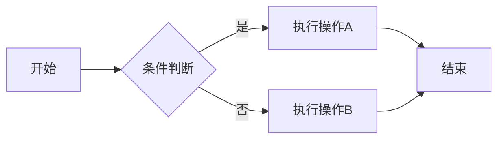

# 前言

在撰写技术博客时，流程图是非常有用的工具，能够清晰地展示逻辑关系和流程步骤。Mermaid 是一个优秀的流程图渲染工具，本文将详细介绍如何在使用 Landscape 主题的 Hexo 博客中成功配置 Mermaid。
# 问题背景

当我们尝试在 Hexo 中使用 Mermaid 时，经常会遇到以下问题：
1. 插件安装后，Mermaid 代码不被渲染，只显示源代码
2. 生成网站时出现各种错误，呃呃呃

# 解决方案

## 第一步：安装 Mermaid 插件

```bash
npm install hexo-filter-mermaid-diagrams --save
```

## 第二步：配置 _config.yml

在你的博客根目录的 `_config.yml` 文件中添加以下配置：

```yaml
# mermaid chart
mermaid:
  enable: true
  version: "11.8.1"  # 根据你的mermaid板本版本进行调整
  options:
    startOnload: true
    theme: 'default'  # 可选: default, forest, dark, neutral
```

**注意**：这个配置要放在根配置文件中，而不是主题配置中。

## 第三步：修改主题文件

这是最关键的一步。我们需要修改 Landscape 主题的 `after-footer.ejs` 文件来加载 Mermaid 脚本。

### 3.1 找到文件位置

文件路径：`node_modules/hexo-theme-landscape/layout/_partial/after-footer.ejs`
由于hexo的默认主题是 Landscape，这个主题的样式文件不在`theme`文件夹下，而是在 `node_modules` 中。

### 3.2 修改文件内容

在`after-footer.ejs`末尾添加以下代码：
```html
<!-- 添加Mermaid流程图渲染begin -->
<% if (config.mermaid && config.mermaid.enable) { %>
  <script src="https://s4.zstatic.net/ajax/libs/mermaid/11.8.1/mermaid.min.js" integrity="sha512-BFmLwKC92En/Mv3/tTlkzotbuaJlvgUvGRyDh1037lTgKhP326tEL1mDN0wl8kXC/ZbNsKd7mT4iOjFC+EhoNg==" crossorigin="anonymous" referrerpolicy="no-referrer"></script>
  <script>
    if (window.mermaid) {
      mermaid.initialize({theme: '<%= config.mermaid.options.theme %>'});
    }
  </script>
<% } %>
<!-- 添加Mermaid流程图渲染end -->
```
## 第四步：在文章中使用 Mermaid

在你的 Markdown 文章中，使用以下格式：

```html
<div class="mermaid">
graph LR
    A[开始] --> B{条件判断}
    B -->|是| C[执行操作A]
    B -->|否| D[执行操作B]
    C --> E[结束]
    D --> E
</div>
```
效果如下
<div class="mermaid">
graph LR
    A[开始] --> B{条件判断}
    B -->|是| C[执行操作A]
    B -->|否| D[执行操作B]
    C --> E[结束]
    D --> E
</div>

2025-07-23 10:43:50 改
注意：在添加pardoc渲染器后，mermaid图表渲染需要使用 ````mermaid` 语法块，而不是先前的 `div`标记 


# 易错总结

1. **配置位置**：
   1. Mermaid 配置放在根 `_config.yml` 中，所以在模板中使用 `config.mermaid` 而不是 `theme.mermaid`
   2. 确保没有创建冲突的自定义主题文件夹，本人不懂渲染的具体实现，添加新的theme导致 Mermaid 代码无法渲染，博客都渲染不出来...

2. **文件修改**：直接修改 `node_modules` 中的文件（虽然不是最佳实践，但在这种情况下是必要的）

3. **语法兼容性**：你的mermaid源码里面不能有空行，即使那让你的源码更高的可读性。

4. **HTML 格式**：使用 `<div class="mermaid">` 包裹 Mermaid 代码，而不是常规代码块的`\```\`markdown 语法。

# 结论

通过以上步骤，你应该能够在 Hexo + Landscape 主题的博客中成功使用 Mermaid 流程图。

