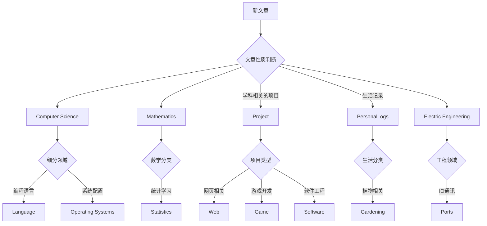

本博客食用指南

# 导航

## Tips：
- Blog在手机和电脑端的显示效果不同，手机边栏的位置在下方，电脑端边栏的位置在右侧。
- 在Home页面，所有的博客按照时间顺序排列，最新的文章在最上方。如果你想查看某个分类的文章，可以点击边栏的分类链接，或者在文章列表中点击分类标签。
- 以[Robomaster](https://www.cai-like.com/tags/Robomaster/)相关的文章为例，在边栏找到Robomaster的tag，点击后会跳转RM相关的文章列表页面。常用的链接放到NAVIGATOR页面中，方便快速访问。
- 使用了Github的静态页面托管服务，国内访问速度较慢

## 管理思路
本页面是导航页。博客的文章根据其所属类别被放入category中，根据其性质被放入tag中。让博客在只有两级分类的前提下，仍然可以有较好的分类效果。

# 分类(categories)
- [Computer Science](https://www.cai-like.com/categories/Computer-Science/)
  - [Language](https://www.cai-like.com/categories/Computer-Science/Language/) 
  - [Operating Systems](https://www.cai-like.com/categories/Computer-Science/Operating-Systems/)

- [Mathematics](https://www.cai-like.com/categories/Mathematics/)
  - [Statistics](https://www.cai-like.com/categories/Mathematics/Statistics/) 

- [Project](https://www.cai-like.com/categories/Project/)
  - [Web](https://www.cai-like.com/categories/Project/Web/) 
  - [Game](https://www.cai-like.com/categories/Project/Game/) 
  - [Software](https://www.cai-like.com/categories/Project/Software/)

- [PersonalLogs](https://www.cai-like.com/categories/PersonalLogs/) 
  - [Gardening](https://www.cai-like.com/categories/PersonalLogs/Gardening) 
- [Electric Engineering](https://www.cai-like.com/categories/Electric-Engineering/)
  - [Ports](https://www.cai-like.com/categories/Electric-Engineering/Ports/) 

# 标签(tags)介绍
用于补充分类的不足，以下是几个常用的标签
- [RoboMaster](https://www.cai-like.com/tags/Robomaster/)比赛相关
- [problem solving](https://www.cai-like.com/tags/problem-solving/) 解决问题的思路
- tutorial文档，也是解决问题，但是侧重于经验总结

# 鸣谢
- 感谢[GitHub Pages](https://pages.github.com/)提供的免费托管服务
- 感谢[Hexo](https://hexo.io/)提供的博客框架
- 感谢[敖武的图床](https://playground.z.wiki/img-cloud/index.html)提供的免费图床服务
- 感谢[Mermaid](https://mermaid.js.org/)提供的图表绘制功能，使用起来非常方便。

